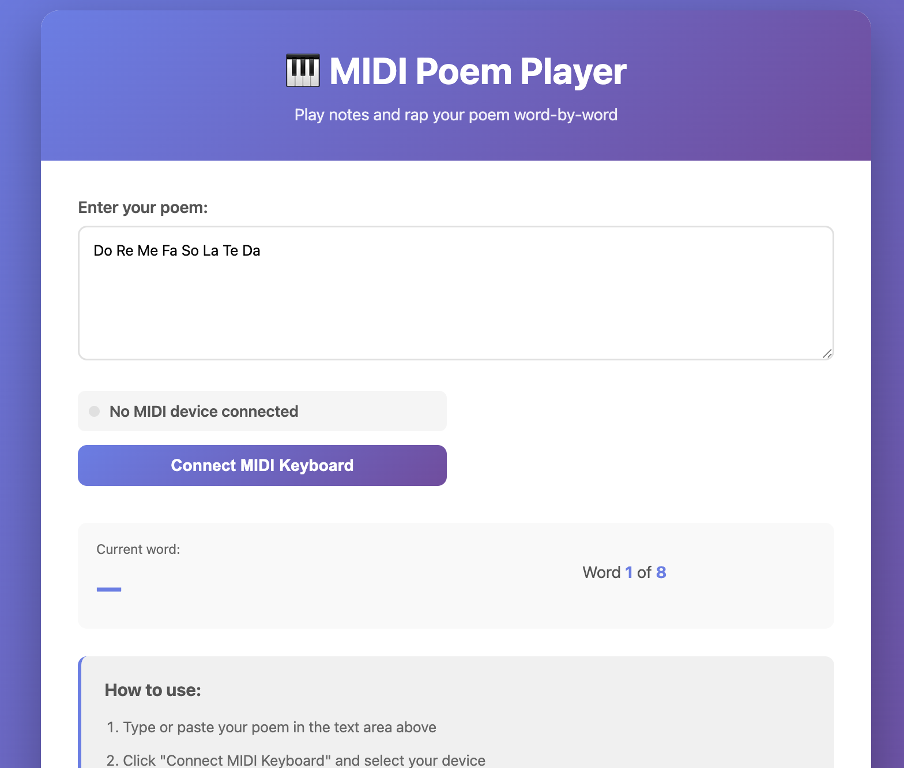

# MIDI Poem Player

🚀 **[Live Demo](https://kylemath.github.io/MidiRapper)** 🚀

A web application that connects to your MIDI keyboard and speaks your poem word-by-word as you play notes. Each note you play sounds out, and the next word from your poem is spoken at that note's pitch - perfect for rapping!

## Features

- 🎹 Connect to any MIDI keyboard via Web MIDI API
- 📝 Type or paste your poem
- 🎵 Play actual MIDI notes - each note you play sounds out
- 🎤 Text-to-speech speaks each word sequentially as you play
- 🎶 Words advance automatically through your poem (perfect for rapping!)
- 🎼 Each word is spoken at the pitch of the note you play

## How to Use

1. **Open the website** in a compatible browser (Chrome, Edge, or Opera recommended)
2. **Type or paste your poem** in the text area
3. **Click "Connect MIDI Keyboard"** and select your MIDI device
4. **Play notes** on your MIDI keyboard - each note will:
   - Play the actual MIDI note you pressed
   - Speak the next word from your poem at that note's pitch
   - Automatically advance to the next word in sequence

**Example:** If your poem is "To be or not to be", playing C, C#, D, E will speak "To", "be", "or", "not" in sequence, each at the pitch of the note you played. Perfect for rapping!

## Browser Compatibility

- **Chrome/Edge**: Full support
- **Opera**: Full support
- **Firefox**: Limited MIDI support
- **Safari**: Limited MIDI support

## Technical Requirements

- Modern browser with Web MIDI API support
- MIDI keyboard connected to your computer
- Microphone permissions (for best experience)

## How It Works

1. Each MIDI note you play sounds out as the actual note
2. The app automatically advances through your poem word-by-word sequentially
3. Each word is spoken using text-to-speech with a pitch that matches the MIDI note you played
4. For example, playing C, C#, D, E will speak words 1, 2, 3, 4 in sequence, each at the pitch of the note
5. Words cycle back to the beginning when you reach the end of the poem
6. This allows you to "rap" by playing any sequence of notes - the words will follow in order

Enjoy creating musical poetry! 🎵📝

## Preview

  

